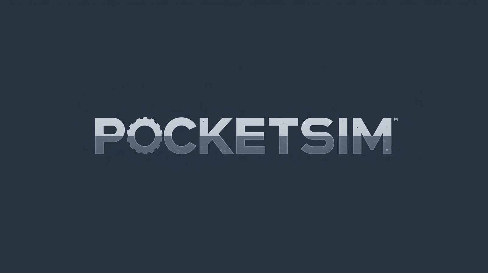

# 🏭 PocketSim — Produktionsimperium

> Baue dein Industrieimperium in Remscheid auf. Verarbeite Rohstoffe, forsche neue Technologien und produziere irgendwann deinen ersten eigenen PKW.



**🌐 Live spielen:** [herosrs.github.io/PocketSim](https://herosrs.github.io/PocketSim/)

---

## 🎮 Was ist PocketSim?

PocketSim ist ein browser-basiertes Produktionsmanagement- und Idle-Spiel. Du startest mit einem leeren Grundstück in Remscheid und baust Schritt für Schritt ein Industrieimperium auf — von der ersten Stammsäge bis zur vollautomatisierten Fahrzeugmontage.

Das Spiel ist inspiriert von Games wie **Factorio**, **Satisfactory** und **Mini Metro**, aber komplett im Browser — ohne Installation, ohne Login, ohne Werbung.

---

## ✨ Features

### 🏗️ Produktionslinien
- **Holz-Linie** — Baumstamm → Brett → Diele → Furnier → Möbel
- **Metall-Linie** — Eisenerz → Roheisen → Stahlbarren → Maschinenrahmen
- **Fahrzeug-Linie** — Karosserie + Achsmodul + Innenausstattung → PKW / Transporter / LKW

### 🏭 Hallensystem
- Tile-Grid mit Drag & Drop — Maschinen frei positionieren
- Leichthalle & Schwerlasthalle mit unterschiedlichen Maschinen-Kompatibilitäten
- Förderbänder zwischen Maschinen mit animiertem SVG-Overlay
- Hallen-Upgrades: Lüftung, Erweiterung, Sicherheit, Dämmung

### 🔬 Forschungsbaum
- 35+ Technologien in 6 Kategorien
- Maschinen werden nach und nach durch Forschung freigeschaltet
- Interaktiver SVG-Baum mit Zoom und Pan

### 📊 Wirtschaft
- Dynamische Marktpreise mit Trend-Anzeige
- Auftrags-System (Normal / Dringend / Großauftrag)
- Statistik-Screen mit Gewinn/Verlust-Graph
- ROI-Berechnung pro Maschine

### ⚡ Ereignis-System
- 10+ zufällige Ereignisse pro Runde
- Positive & negative Effekte (Holzboom, Energiekrise, Streik, Förderung...)
- Spielmodi: Startup, Normal, Hardcore

### 📱 Progressive Web App
- Installierbar auf iOS & Android
- Offline spielbar
- Kein Server nötig nach Installation

---

## 🚀 Spielen

### Im Browser
Einfach aufrufen: **[herosrs.github.io/PocketSim](https://herosrs.github.io/PocketSim/)**

### Als App installieren (empfohlen)
**iPhone/iPad:**
1. Safari öffnen → Seite aufrufen
2. Teilen-Button → "Zum Home-Bildschirm"
3. PocketSim-Icon antippen → Vollbild, kein Browser

**Android:**
1. Chrome öffnen → Seite aufrufen
2. Menü → "App installieren"
3. Fertig!

### Lokal ausführen
```bash
git clone https://github.com/HerosRS/PocketSim.git
cd PocketSim
python3 server.py
# → http://localhost:8080
```

---

## 🗂️ Projektstruktur

```
PocketSim/
├── index.html          # Haupt-HTML
├── style.css           # Komplettes CSS (Dark Theme)
├── manifest.json       # PWA Manifest
├── sw.js               # Service Worker (Offline-Cache)
├── server.py           # Lokaler Dev-Server
│
├── data/               # Spieldaten (JSON)
│   ├── materialien.json    # 37 Materialien
│   ├── rezepte.json        # 26 Rezepte
│   ├── maschinen.json      # 19 Maschinen
│   ├── gebaeude.json       # 6 Gebäude
│   ├── forschung.json      # 35 Forschungen
│   ├── grundstuecke.json   # Remscheid, Solingen, Wuppertal
│   ├── auftraege.json
│   ├── ereignisse.json
│   ├── spielmodi.json
│   └── hallen_upgrades.json
│
├── js/                 # JavaScript Module
│   ├── main.js             # Einstiegspunkt
│   ├── state.js            # Spielstand & Variablen
│   ├── produktion.js       # Produktionsloop & Timer
│   ├── hallenplan.js       # Tile-Grid Renderer
│   ├── foerderband.js      # Förderband-System
│   ├── hallen_upgrades.js  # Hallen-Upgrades
│   ├── labor.js            # Forschungsbaum (SVG)
│   ├── wirtschaft.js       # Markt & Preise
│   ├── auftraege.js        # Auftrags-System
│   ├── ereignisse.js       # Ereignis-System
│   ├── statistik.js        # Statistik & Graphen
│   ├── shop.js             # Shop
│   └── ...
│
├── assets/             # Bilder für Materialien & Maschinen
└── icons/              # PWA Icons
```

---

## 🛠️ Technologie

| Was | Womit |
|-----|-------|
| Frontend | Vanilla HTML/CSS/JavaScript |
| Keine Frameworks | Kein React, kein Vue, kein jQuery |
| Daten | JSON-Dateien |
| Speichern | localStorage |
| Offline | Service Worker (PWA) |
| Hosting | GitHub Pages |
| Fonts | Google Fonts (Rajdhani + Inter) |

---

## 🗺️ Roadmap

- [x] Holz-Produktionslinie
- [x] Metall-Produktionslinie  
- [x] Tile-Grid Hallensystem
- [x] Drag & Drop Maschinen
- [x] Förderbänder
- [x] Forschungsbaum
- [x] Ereignis-System
- [x] Statistik & Graphen
- [x] PWA / Offline-Modus
- [ ] Fahrzeug-Produktionslinie (in Arbeit)
- [ ] Garage & Fuhrpark-System
- [ ] Throughput-Anzeige
- [ ] Achievements
- [ ] Mehr Grundstücke & Städte

---

## 👨‍💻 Entwicklung

Entwickelt von **Luca** (HerosRS) mit Unterstützung von Claude (Anthropic).

Lernprojekt mit dem Ziel: Ein vollständiges Spiel im Browser bauen — ohne Frameworks, nur mit den Grundlagen.

---

## 📄 Lizenz

Privates Projekt — kein Open Source.  
© 2025 HerosRS

